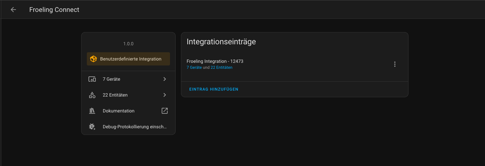
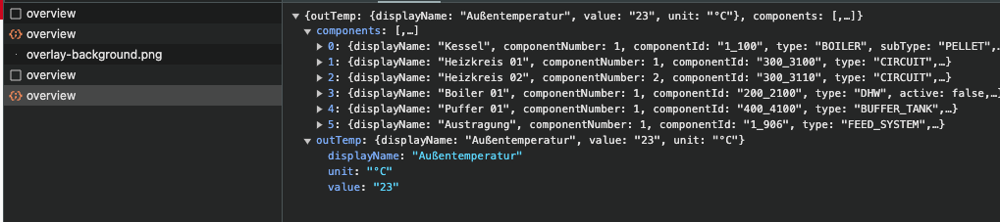

# Fröling Connect Integration for Home Assistant

A brief description of what this project does and who it's for


## Installation

Add the repository to your custom HACS repositories. 

OR

Copy the froeling_connect folder to your custom components in Home Assistant.

Restart your HA instance.


Go to https://connect-web.froeling.com/login and login to your Account.

Click on your heating-system and remeber the facility in the url.
(Will be needed for the Integration)

Go to settings and add the integration.

--> follow the config-follow

After that you should see your devices with sensors under the devices-tab.




## How it works

The **\_\_init\_\_.py** establishes a connection and logging you in using the 
**api.py** ***connect*** method.

The Bearer-Token returned is then used for future requests.

The ***getDevices*** method fetches the json for the _facility_id_ of the config_entry.

The result looks like this:



The method is then creating one Device for the *out_temp* and one for every components in json *components array*.

The sensors will be added to the devices by specifying the same identifiers in the device-info.

***self.add_entities_to_device*** is called for every device to add the sensors.
The sensors to be added are specified in an array, providing the key in the component-response to be matched against. (adjust to your preferrence)

#### Example:

**['desiredRoomTemp',mode','actualFlowTemp']** 
```
self.add_entities_to_device(component,f"{self.controller_name}_{component['componentId']}",['desiredRoomTemp',mode','actualFlowTemp'])
```


## Disclaimer

***This is something I build for myself having a Froeling P1 Pellets Heating System***

***Other systems json-response might be different!***

***You can check the response in ypour browser looking at the overview service in the network tab***
## Authors

- [@d3nergy](https://www.github.com/d3nergy)

